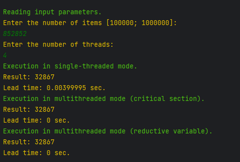

Технология OpenMP
======
#### Краткое содержание работы:
Распараллеливание вычислений средствами OpenMP.

Лабораторная работа выполняется на языке C++ в среде Visual Studio. Во всех заданиях следует обеспечить контроль вводимой информации. При некорректном вводе – повторно запрашивать информацию у пользователя.
Выполнить вычисления в однопоточном и многопоточном режиме и сравнить времена выполнения. Количество потоков задаётся пользователем. Количество исходных данных не кратно в общем случае количеству потоков. Исходные данные для задания генерируются с помощью генератора псевдослучайных чисел, где 100000<n<1000000, 100<An<10000000. Результаты сравниваются по времени выполнения при разном числе процессов и объёме данных и оформляются в виде таблицы. В отчёте приводятся снимки экрана, программный код, таблицы тестов и замеров времени выполнения, формулируется вывод. Количество потоков по-умолчанию при необходимости получать средствами OpenMP.

#### Вариант задания
Дана последовательность натуральных чисел {a0…an–1}. Создать многопоточное приложение для поиска суммы корней квадратных из ai. 
### Результат выполнения
